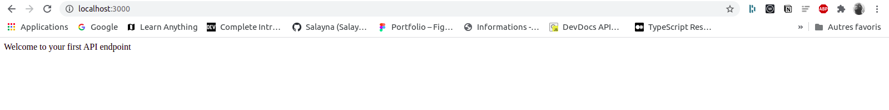
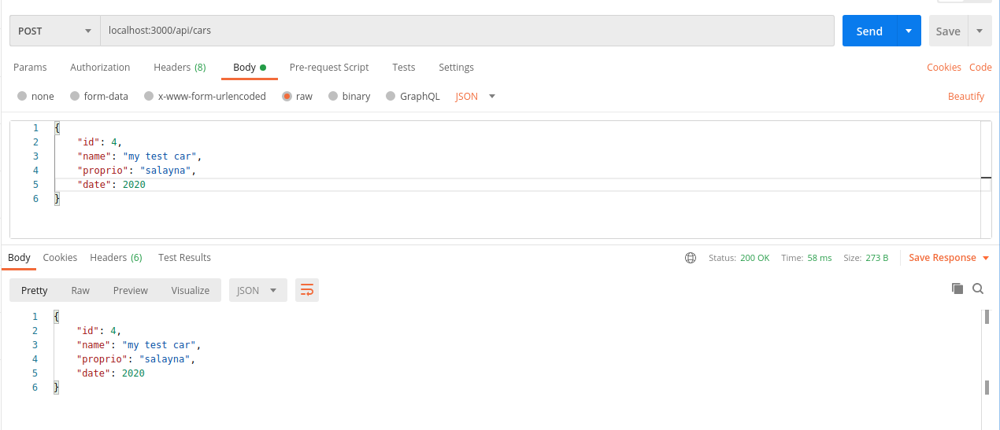

# Qu'est ce qu'une API
Une API (Application Programming Interface) est un set de méthodes, de variables, et de protocoles permettent d'interfacer deux applications. On distingue plusieurs types d'API:  
- d'un côté on peut avoir une API qui servir à utilisé les fonctions d'une autre application, pour par exemple intégrer certains modules à d'autres
- de l'autre côté on peut avoir une api qui servir des données à notre application comme les API en GraphQL ou Rest(ce qiue l'on va voir aujourd'hui)
## Le modèle REST
Le modèle **REST**(REpresentational State Transfer) est un ensemble de règles et de contraintes à respecter pour la création de services web. Ces services permettent manipulation de resources web et se repose lourdement sur le protocoles HTTP.
### Le protocole HTTP en bref
Le protocole HTTP est l'un des protocoles principale du World Wide Web(les fameux www). Le HTTP se repose lui même sur le MIME(Multipurpose Internet Mail Extensions) qui définis les fichiers transferable à travers internet(comme son nom l'indique le MIME a été d'abord pensé pour l'envoie de différents types de fichiers par mail)
#### Les méthodes
Le protocole compte des méthodes qui vont définir les actions possible sur les ressources, parmis lesquels on peut compter:
- GET est la méthode qui permet de demander une ressource au serveur
- POST permet d'envoyer des données au serveur
- PUT permet aussi d'envoyé des données au serveur en vue d'un ajout ou d'une modification totale de la ressource
- DELETE permet de supprimer la ressource visé
- PATCH permet d'effectuer une modification partiel de la ressource    

Les API REST vont se reposé sur les méthodes http pour gérer leurs requêtes.

# Implémentons
*ps: On utilisera du NodeJS pour ce tutoriel, le but de comprendre comment ça marche, vous pourrez trouver un repos github contenant le code du tutoriel à la fin de celui ci*

## Initialisation du projet
Pour commencer nous allons initialisé notre projet comme ceci:
- on va d'abord créer notre dossier (le nom importe peu)
- on s'assure que Node est installé avec la commande ``node -v`` si ce n'est pas le cas je vous renvoie vers le site officiel https://nodejs.org/en/download/
- Une fois Node installé on va effectuer la commande ``npm init``,on devrait avoir un prompt où remplir des informations trivial à la suite de quoi on aura à la racine de notre projet un fichier `package.json`.
- on va ensuite créer un fichier index.js ausi la racine du projet.

Avant d'aller plus loin on va d'abord expliquer quelques points vu au dessus:
### Qu'est-ce que NodeJS ? 
NodeJS est une plateforme logiciel qui permet de booster le Javascript qui, avant tout ça était surtout un langages utilisé pour faire de belles animation et rendre un peu plus dynamique les sites webs. Le NodeJS permet au Javascript d'être utilisé côté serveur et de faire un bon nombre de choses assez incroyable (programmation asynchrone etc...)
### À quoi sert le fichier package.json
le fichier package.json sert de fichier de controle pour votre projet. Le nom, l'auteur, des script utile, les dépendances et pleins d'autres informations sont stocké à l'interieur de ce fichier.  

### Ajout de dépendances
 On va avoir besoin de quelques dépendances pour ce projet.
 - Express: pour la création du serveur web et la gestion de requêtes
 - Body-Parser: Pour la récupération du corps des requêtes
 - nodemon: pour ne pas avoir à toujours redémarrer notre app pendant que l'on développe

 Pour installer ces dépendances on va utilisé la commande `npm install express body-parser`  
 Vous noterez que je n'ai pas mis nodemon dans la commande juste, c'est parce que je veux avoir nodemon que pendant le développement et pas en production, donc je vais l'installer en **dev dependency** comme ceci:  
 `npm install --save-dev nodemon`  
 Votre ficher `package.json` devrait maintenant avoir ces dex objets:  
 ```json
 "dependencies": {
    "body-parser": "^1.19.0",
    "express": "^4.17.1"
  },
  "devDependencies": {
    "nodemon": "^2.0.7"
  }
 ```
 et votre dossier compte iun maintenat un fichier `package-lock.json` qui répertory les dépendances de vos dépendances, qui sont contenue dans le dossier nodes_modules(Je vous déconseille fortement de toucher à ces deux entités, mais vous pouvez regarder si vous êtes de nature curieuse).
  
 maintenant que notre projet est en place, on peut commencer à coder.

 ## Création de notre serveur web et envoie de texte
  Dans le ficher index.js on va ajouter le code suivant:
  ```js
const express = require("express");
const app = express();

function sendStartingMessage(port) {
    console.log('app running on port '+port)
}
app.listen(3000, startingMessage(3000));
  ```
Maintenant en effectuant la commande `node .` à la racine de notre projet on devrait avoir le message "app running on port 3000". Ok,mais comment ça se fait ? Reprenon le code ligne par ligne.  
Dans les deux première ligne on va importer notre module avec la fonction require("`{le nom du module à importer}`"), dont on va créer un objet dans la variable app. On va ensuite créer un port d'écoute avec la fonction `listen()` qui prends en paramètre le port d'écoute. Vous noterez que `listen()` a aussi un paramètre assez particulier qui est la fonction `sendStartingMessage()`, c'est ce qu'on appelle un callback et ce callback ne va être effectuer que si le serveur est est bien initialisé.effectuons un tout petit changement à ce dernier.  
```js
const express = require("express");
const app = express();

app.listen(3000, ()=>{
    console.log('app running on port 3000');
});
```
Votre server fonctionne maintenant mais vous ne pouvez rien faire, on va donc créer notre premier endpoint juste au dessus de notre `app.listen()`:
```js
app.get('/', (req, res)=> {
    res.send("Welcome to your first API endpoint")
});
```
Nous venons tout juste de rajouter un GET avec la fonction `app.get()` qui prends en paramètre la route de la ressource dans ce cas ci la racine '/' et une callback dont les arguments seront req: la requête, res: la réponse on va ensuite dire, dans ce callback, à notre serveur d'envoyé comme réponse "Welcome to your first API endpoint";
Avant de tester cette requête on va juste rajouter un petit script qui va nous simplifier la vie dans le `package.json`. dans l'objet scripts ajoutez: 
``"dev:start": "nodemon ."``  
votre object scripts devrait maintenant ressembler à ça: 
```json
"scripts": {
    "test": "echo \"Error: no test specified\" && exit 1",
    "dev:start": "nodemon ."
  },
```
vous pouvez ensuite interrompre l'exécution de votre code et taper la commande ``npm run dev:start`` dans le terminal. maintenant à chaque que vous sauvergarderez vos modifications le code sera exécuté automatiquement.
Pour tester si notre GET fonctionne, rien de plus simple, on va juste aller sur notre navigateur et allez à l'adresse suivante: http://localhost:3000/
vous devriez avoir ce résultat.  
.

Avant d'aller plus loin créer des données factices pour notre API. Créons donc un tableau cars qui sera un tableau de voiture
```js
let cars = [];

let car1 = {
    id: 1,
    name: "Tesla Model S",
    proprio: "Mr Iervese",
    date: 2017,
}

let car2 = {
    id: 2,
    name: "Lamborghini Urus",
    proprio: "Mr Hagot",
    date: 2019,
}

let car3 = {
    id: 3,
    name: "Ferrari Roma",
    proprio: "Mr Georges",
    date: 2016,
}

cars.push(car1, car2, car3);
```
## API CRUD
Dans la partie ci-dessous on va implémenter un CRUD (Create Read Update Delete) sur les voitures.

### Read
Le Read passe donc par la méthode GET du protocole HTTP.On va d'avord conc commencer par le Read étant la fonction la plus simple, on fera trois lecture une qui permettra de récupérer toutes les voitures et deux qui permettront de récupérer une voiture en fonction de ses attributs.
Pour le premier Read on va rajouter un endpoint sur la route '/cars'. et ce endpoint renverra juste le contenue de notre tableau cars.
```js
app.get('api/cars', (req, res)=> {
    res.send(cars);
})
```
Assez simple comme première fonction *notez que je fais ici abstraction de tout ce qui est base de données dans un exemple d'API en production(surement la prochaine leçon) le code sera beaucoup plus fourni*. Pour la prochaine fonction on récupèrera une voiture en fonction de paramètres de la voiture en paramètre en utilisant le paramètre req de la callback de la fonction get. Mais il y a deux manière de récupérer le paramètre soit à travers le `req.query` ou à travers le `req.params` le choix de l'un des deux va drastiquement changer comment coder sa fonction. On va donc voir les deux.
#### req.params
**req.params** va s'occuper de parser les paramètre au niveau de la route et pas de l'URL. La différence entre la route et l'url est assez subtile mais disons que l'URL est l'entité en entière par exemple le "https://localhost:3000/cars" là où la route est plus une définission de chemin par exemple `api/cars/`. Pour utilisé req.params on va d'abord dire au router de notre api qu'on attent une valeur au niveau de la route comme ceci: 
```js
app.get('/api/cars/:id', (req, res)=>{
    const id  = req.params.id
    const car = cars.find(element => element.id === id);
    res.send(car);
});
```
Comme vous pouvez la route a une forme particulière avec son `:id`, ce `:id` va permettre de dire à l'api qu'ici on attent  une variable et c'est cette variable qu'on va récupérer avec le `req.params.id`.
l'URl aura donc cette tête: `http://localhost:3000/api/cars/2`
#### req.query
Pour le **req.query** la requête va totalement changer de tête puisque les paramètre vont être parser après un `?` et on a pas besoin de spécifier au router de l'api avant. la route aura donc cette tête:
```js
app.get('/api/car', (req, res)=>{
 const id = req.query.id;
 const date = req.query.date;
 const car = cars.find(element => (element.id === id) && (element.date === date));
 res.send(car); 
});
```
cotez que vous pouvez mettre autant paramètre que vous voulez et que donc vous devez réfléchir en amont à ce que vous voulez récupérer sachant que si les paramètres ne sont pas pris en compte dans le code c'est comme s'ils n'existent pas.
l'url pour cettre route ressemblera à ça: `http://localhost:3000/api/car?id=2&date=2019`.

Nous avons donc mis en place nos routes `GET` mais celà ne s'arrête pas là ils nous reste `POST`(pour le CREATE), `PATCH`(pour le UPDATE), `DELETE`(pour le DELETE). Passons donc au POST.

### CREATE

pour cette fonction on passer par la méthode POST du protocole HTTP, mais ce sera un peu spécial cette fois ci et un peu plus fourni. Dans le cas de la méthode POSt on va passer les données dans le corps de la requête la body et pour se faire on devoir le parser, c'est là qu'intervient `body-parser` qui va passer en tant que middleware à express comme montrer ci dessous
```js
const bodyParser = require("body-parser");
app.use(bodyParser.json())
```
body-parser va donc s'occuper de parser les données que l'API va recevoir. Maintenant il faut que l'on cré la route qui va s'occuper de recevoir ces données donc on va créer une route post cette fois ci:
```js
app.post('/api/cars', (req, res)=> {
 const body = req.body;
 cars.push(body);
 res.send(body);
});
```
pour l'instant on se contente juste de renvoyé les données reçu en body. Mais tester cette requête va s'avérer plus compliqué car cette fois ci on doit envoyé des données.On peut le faire de deux différentes manière avec CURL, ou un client comme [POSTMAN](https://www.postman.com/downloads/), ce que je vous recommande et aussi ce que j'utilise.
Donc dans le corps de notre requête sur POSTMAN on va y mettre un objet car.
.
Avec ceci notre CREATE est fait il nous reste donc le UPDATE et le DELETE.

### UPDATE
Le UPDATE (PATCH en HTTP) en http est un mélange du GET du POST car on va devoir u'a&bord chercher la ressource avec son id et ensuite lui dire les champs à éditer, dans l'exemple on va juste le faire avec le proprio de la voiture, on va d'abord créer la route qui convient
```js
app.patch('/api/car/:id', (req, res)=>{
    const id = req.params.id
    let car = cars.find(element => element.id === id);
    let proprio = req.body.proprio;
    car.proprio = proprio;
    res.send(car);
});
```
avec cette méthode 