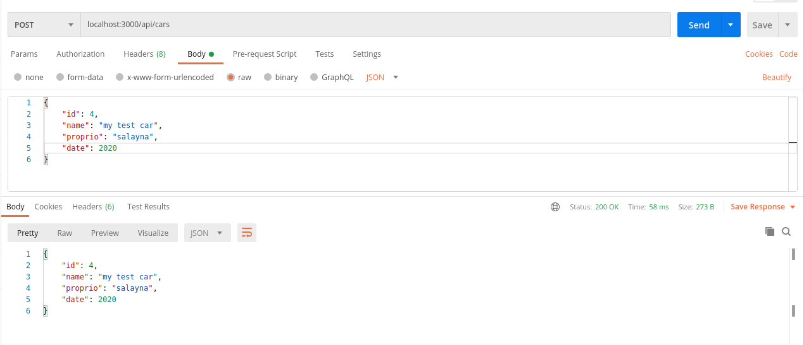
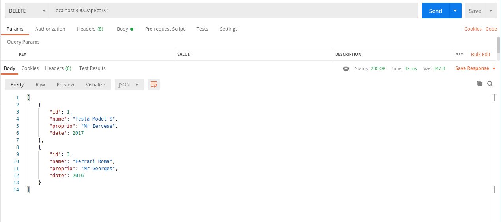

# What is an API
An Application Programming Interface (API) is a set of methods, variables, and protocols to connect two applications. There are several types of APIs:
- on the one hand we can have an API that can be used to use the functions of another application, for example to integrate certain modules with other applications
- on the other hand we can have an API that will serve data to our application like APIs in GraphQL or Rest (what we will see today)
## The REST model
The **REST**(REpresentational State Transfer) model is a set of rules and constraints to be followed when creating web services. These services allow manipulation of web resources and rely heavily on HTTP protocols.
### Quick overview of the HTTP Protocol
The HTTP protocol is one of the main protocols of the World Wide Web (the famous www). The modern HTTP relies itself on the MIME (Multipurpose Internet Mail Extensions) which defines the files transferable through the internet (as its name indicates the MIME was first thought to send different types of files by mail)
#### HTTP methods
The protocol includes methods that will define possible actions on resources, among which we can count:
- GET is the method for requesting a resource from the server
- POST allows data to be sent to the server for resource creation
- PUT also allows data to be sent to the server for a total addition or modification of the resource
- DELETE removes the target resource
- PATCH allows a partial modification of the resource

REST APIs will rely on http methods to manage their requests.

# Let's code
*ps: We will use NodeJS for this tutorial, in order to understand how it works, you can find a github rest containing the tutorial code at the end of it*

## Project setup
To begin we will initialize our project as follows:
- we will first create our folder (the name doesn’t matter)
- make sure that Node is installed with the ``node -v```' command if this is not the case I refer you to the official website https://nodejs.org/en/download/
- Once Node is installed, we will perform the command ``npm init``, we should have a prompt where we fill in trivial information and then we will have a file `package.json' at the root of our project.
- we will then create an index.js file also the root of the project.

Before going any further we will first explain some points seen above:
### What is NodeJS ? 
NodeJS is a software platform that boosts Javascript, which was primarily a language used to make nice animations and make websites a little more dynamic. The NodeJS allows Javascript to be used on the server side and to do a lot of pretty amazing things (asynchronous programming etc...)
### What is the package.json ?
The package.json file serves as a control file for your project. The name, author, useful scripts, dependencies and lots of other information are stored inside this file.  

### Let's add our dependencies
 We’re gonna need some dependencies on this project.
- Express: for web server creation and query management;
- Nodemon: so you don’t always have to restart your app while you develop

To install these dependencies we will use the command `npm install express'
You will note that I did not put nodemon in the command just, it is because I want to have nodemon that during development and not in production, so I will install it in **dev dependency** like this:
`npm install --save-dev nodemon'
Your package.json file should now have these two objects:
 ```json
 "dependencies": {
    "express": "^4.17.1"
  },
  "devDependencies": {
    "nodemon": "^2.0.7"
  }
 ```
and your folder now has a `package-lock.json' file that lists the dependencies of your dependencies, which are contained in the nodes_modules folder (I strongly advise against touching these two entities, but you can see if you are curious by nature).    
 Now that our project is in place, we can start coding.
 ## Creating the web server and sending basic text
  In the index.js file we will add the following code:
  ```js
const express = require("express");
const app = express();

function sendStartingMessage(port) {
    console.log('app running on port '+port)
}
app.listen(3000, startingMessage(3000));
  ```
Now by running the `node . .' command at the root of our project we should have the message "app running on port 3000" in the terminal. Okay, but how does that work? Let’s go line by line.  
In the first two lines we will import our module with the function `require("{the name of the module to import}")`, which we will create an object in the variable `app'. We will then create a listening port with the `listen()`function which takes as parameter the listening port. You will note that `listen()' also has a rather special parameter which is the `sendStartingMessage()' function, this is called a callback and this callback will only be performed if the server is properly initialized. Let us make a very small change to it.
```js
const express = require("express");
const app = express();

app.listen(3000, ()=>{
    console.log('app running on port 3000');
});
```
Your server is working now but you can’t do anything, so we’re going to create our first endpoint right above our `app.listen()':
```js
app.get('/', (req, res)=> {
    res.send("Welcome to this demo API")
});
```
We have just added a GET with the `app.get() function which takes as parameter the route of the resource in this case the root '/' and a callback whose arguments will be **req**: the request, **res**: the response we will then say, in this callback, to our server sent as a "Welcome to this demo API" response;
Before testing this request we will just add a small script that will simplify our life in the `package.json`. in the scripts object add: 
```"dev:start": "nodemon ." ``  
Your scripts object should now look like this:
```json
"scripts": {
    "test": "echo \"Error: no test specified\" && exit 1",
    "dev:start": "nodemon ."
  },
```
you can then stop the execution of your code and type the command ``npm run dev:start``in the terminal. now each time you save your changes the code will be executed automatically.
To test if our GET works, nothing is simpler, we will just go to our browser and go to the following address: http://localhost:3000/
You should have that result.  
.

Before going any further create dummy data for our API. So let’s create a cars array that will be a car array
```js
let cars = [];

let car1 = {
    id: 1,
    name: "Tesla Model S",
    proprio: "Mr Ren",
    date: 2017,
}

let car2 = {
    id: 2,
    name: "Lamborghini Urus",
    proprio: "Mr Pierre",
    date: 2019,
}

let car3 = {
    id: 3,
    name: "Ferrari Roma",
    proprio: "Mr Henry",
    date: 2016,
}

cars.push(car1, car2, car3);
```
## CRUD on API
In the part below we will implement a CRUD (Create Read Update Delete) on cars.

### Read
The Read goes through the GET method of the HTTP protocol.We will first start with the Read being the simplest function, we will make three read one that will recover all cars and two that will recover a car according to its attributes.
For the first Read we will add an endpoint on the road '/cars'. and this endpoint will just return the contents of our table cars.
```js
app.get('api/cars', (req, res)=> {
    res.send(cars);
})
```
Quite simple as a first function *note that I am ignoring everything that is database in an example of an API in production (probably the next lesson) the code will be much more provided*. For the next function we will recover a car based on some information about the car as parameter using the req parameter of the callback of the get function. But there are two ways to retrieve the parameter either through req.query' or through req.params' the choice of one of the two will change how to code the function. So we’re going to see both.
#### req.params
**req.params** will parse the parameters at the route level and not the URL. The difference between the route and the URL is quite subtle but let’s say that the URL is the entire entity for example the "https://localhost:3000/cars" where the route is more a path definition for example `api/cars/`. To use req.params we will first tell the router of our api that we expect a value at the level of the route like this: 
```js
app.get('/api/cars/:id', (req, res)=>{
    const id  = req.params.id
    const car = cars[id-1]
    res.send(car);
});
```
As you can see the route has a particular shape with its `:id', this `:id`will let you tell the api that here you are expecting a variable and it is this variable that you will retrieve with the `req.params.id'.
the URL will have this head: `http://localhost:3000/api/cars/2`
##### req.query
For the **req.query** the request will completely change its head since the parameters will be parsed after a ``?```) (a query in English) and we do not need to specify to the router of the api before. the road will have this head:
```js
app.get('/api/car', (req, res)=>{
 const id = req.query.id;
 const date = req.query.date;
 const car = cars.find(element => (element.id === id) && (element.date === date));
 res.send(car); 
});
```
Note that you can set as many parameters as you want, so you have to think ahead of time about what you want to recover knowing that if the parameters are not taken into account in the code it is as if they do not exist.
The URL for this route will look like this: `http://localhost:3000/api/car? id=2&date=2019'.

So we set up our `GET`s routes, but that does not stop there. We still have `POST`(for the CREATE), `PATCH`(for the UPDATE), `DELETE`(for the DELETE). Let’s go to POST.

### CREATE

For this feature we go through the POST method of the HTTP protocol, but it will be a bit special this time. In the case of the POST method we will pass the data into the body of the request, the body, and to do so we will have to parse it, this is where the middleware `json™s integrates into the express that we will integrate like this:
````js
app.use(express.json())
````
This middleware will therefore parse the data that the API will receive. Now we have to create the road that will take care of receiving this data so we will create a road post this time:
```js
app.post('/api/cars', (req, res)=> {
 const body = req.body;
 cars.push(body);
 res.send(body);
});
```
Testing this request will be more complicated because this time we have to send data. You can do this in two ways with CURL, or a customer like [POSTMAN](https://www.postman.com/downloads/), which I recommend and also what I use.
So in the body of our request on POSTMAN we’re going to put a car in it.
.
With this our CREATE is done, so we still have the UPDATE and DELETE.

### UPDATE
The UPDATE (HTTP PATCH) in HTTP is a mixture of the GET and the POST because we will first have to look for the resource with its id and then tell it the fields to edit, in the example we will just do it with the owner of the car, we will first create the appropriate route
```js
app.patch('/api/car/:id', (req, res)=>{
    const id = req.params.id
    let proprio = req.body.proprio;
    cars[id-1].proprio = proprio;
    res.send(cars[id-1]);
});
```

With this method we manage to modify a data now it only remains to be able to delete it.

### DELETE
The DELETE is the same as the PATCH except that here we do not want to edit a data but delete it, so we will do it like this:
```js
app.delete('/api/car/:id', (req, res)=>{
    const id = req.params.id;
    cars.splice(id-1, 1);
    res.send(cars);
});
```

And normally you should have your operational CRUD, but an API remains is more than that, because we also need to know if our operation is a success or a failure and that’s where the response code between games.

### Status Codes
Status Codes are classified as follows:
- 2XX corresponds to successful requests
- 4xx corresponds to failures but customer side
- 5xx corresponds to side errors 

you will find a list of [code](https://developer.mozilla.org/en/docs/Web/HTTP/Status) here.


So we’ll, uh, add in the success codes and then we’ll go deal with the mistakes. Success codes are quite simple to add just put it in the prefix of the send, in this way res.status({status code}). send({our message})`.
For the create case it will be a 201 code so the response will look like that `res.status(201). send({message: "Car added to the db", entity: car}) and for the rest we use 200 *note that to delete we can put 204 provided the request is empty*. 

We can then move to error management in the case of get you must check that the resources can be found. So we will perform the checks and if this is not the case we will send error code 404(the famous) with the message "resource not found" then we must check if the data sent is good, if our property field is a text and not a number, if applicable, an error 400 will be placed followed by the message (Bad request). 

We end up with the following code:
```js
const express = require("express");
const app = express();
app.use(express.json())

let cars = [];

let car1 = {
    id: 1,
    name: "Tesla Model S",
    proprio: "Mr Ren",
    date: 2017,
}

let car2 = {
    id: 2,
    name: "Lamborghini Urus",
    proprio: "Mr Pierre",
    date: 2019,
}

let car3 = {
    id: 3,
    name: "Ferrari Roma",
    proprio: "Mr Henry",
    date: 2016,
}

cars.push(car1, car2, car3);

app.get('/', (req, res)=> {
    res.send("Welcome to this demo API")
});

app.get('/api/cars', (req, res)=> {
    res.send(cars);
});

app.get('/api/cars/:id', (req, res)=>{
    const id  = req.params.id
    if(!cars[id-1]){
        res.status(404).send("ressources not found");
        return;
    }
    res.status(200).send(car);
});

app.post('/api/cars', (req, res)=> {
 const body = req.body;
 if(!body.id ||!body.name || !body.proprio || !body.date) {
     res.status(400).send("Bad Request");
     return
 }
 
 cars.push(body);
 res.status(201).send({
     message: "Entity added to the db",
     entity:body
 })
});

app.patch('/api/car/:id', (req, res)=>{
    const id = req.params.id
    if(!cars[id-1]){
        res.status(404).send("ressources not found");
    } 
    let proprio = req.body.proprio;
    if(typeof proprio !== 'string' || proprio instanceof String === false) {
        res.status(400).send("Bad Request");
        return;
    };
    cars[id-1].proprio = proprio;
    res.status(200).send(cars[id-1]);
});

app.delete('/api/car/:id', (req, res)=>{
    const id = req.params.id;
    if(!cars[id-1]) {
        res.status(404).send("Ressource not found");
        return;
    }
    cars.splice(id-1, 1);
    res.status(200).send(cars);
});

app.listen(3000, ()=>{
    console.log('app running on port 3000');
});
```
Voilà ! You have your first REST API !

The next classes of the serie will be on making a REST API with a NoSQL database(like MongoDB) and One with a SQL Database(like PostgreSQL) with and without and ORM(I'll explain everything in a next class).

Do not hesitate to give me feedbacks bin the comment section just below ! See you soon !
